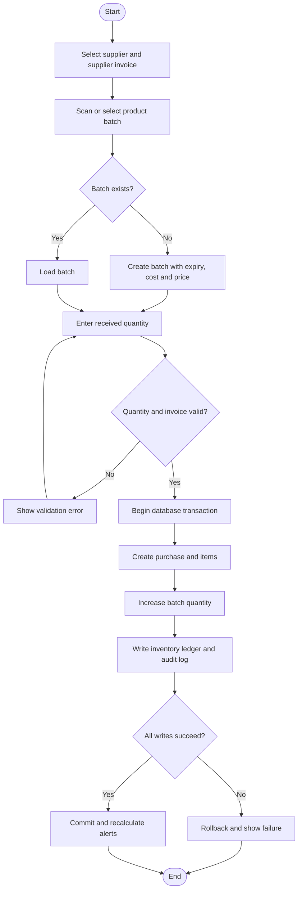

# Activity Diagram — Purchase to Available Stock

```mermaid
flowchart TD
  A([Start]) --> B[Select supplier and supplier invoice]
  B --> C[Scan or select product batch]
  C --> D{Batch exists?}
  D -- No --> E[Create batch with expiry, cost and price]
  D -- Yes --> F[Load batch]
  E --> G[Enter received quantity]
  F --> G
  G --> H{Quantity and invoice valid?}
  H -- No --> I[Show validation error]
  I --> G
  H -- Yes --> J[Begin database transaction]
  J --> K[Create purchase and items]
  K --> L[Increase batch quantity]
  L --> M[Write inventory ledger and audit log]
  M --> N{All writes succeed?}
  N -- No --> O[Rollback and show failure]
  N -- Yes --> P[Commit and recalculate alerts]
  O --> Q([End])
  P --> Q
```
