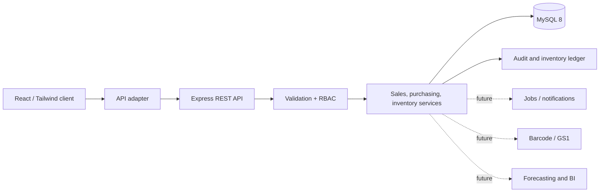

# Extensible Architecture

The UI can run against demo data for presentation or switch to the API adapter. Service boundaries isolate domain rules from transport and storage. MySQL transactions and row locks keep sales, purchases, batches, ledger entries, and audits consistent. New integrations should subscribe to committed events rather than changing stock directly.
