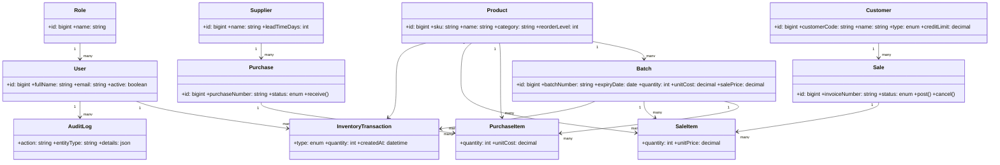

# Class Diagram

```mermaid
classDiagram
  class Role { +id: bigint +name: string }
  class User { +id: bigint +fullName: string +email: string +active: boolean }
  class Product { +id: bigint +sku: string +name: string +category: string +reorderLevel: int }
  class Batch { +id: bigint +batchNumber: string +expiryDate: date +quantity: int +unitCost: decimal +salePrice: decimal }
  class Supplier { +id: bigint +name: string +leadTimeDays: int }
  class Customer { +id: bigint +customerCode: string +name: string +type: enum +creditLimit: decimal }
  class Purchase { +id: bigint +purchaseNumber: string +status: enum +receive() }
  class PurchaseItem { +quantity: int +unitCost: decimal }
  class Sale { +id: bigint +invoiceNumber: string +status: enum +post() +cancel() }
  class SaleItem { +quantity: int +unitPrice: decimal }
  class InventoryTransaction { +type: enum +quantity: int +createdAt: datetime }
  class AuditLog { +action: string +entityType: string +details: json }
  Role "1" --> "many" User
  Product "1" --> "many" Batch
  Supplier "1" --> "many" Purchase
  Purchase "1" --> "many" PurchaseItem
  Product "1" --> "many" PurchaseItem
  Batch "1" --> "many" PurchaseItem
  Customer "1" --> "many" Sale
  Sale "1" --> "many" SaleItem
  Product "1" --> "many" SaleItem
  Batch "1" --> "many" SaleItem
  Product "1" --> "many" InventoryTransaction
  Batch "1" --> "many" InventoryTransaction
  User "1" --> "many" InventoryTransaction
  User "1" --> "many" AuditLog
```
