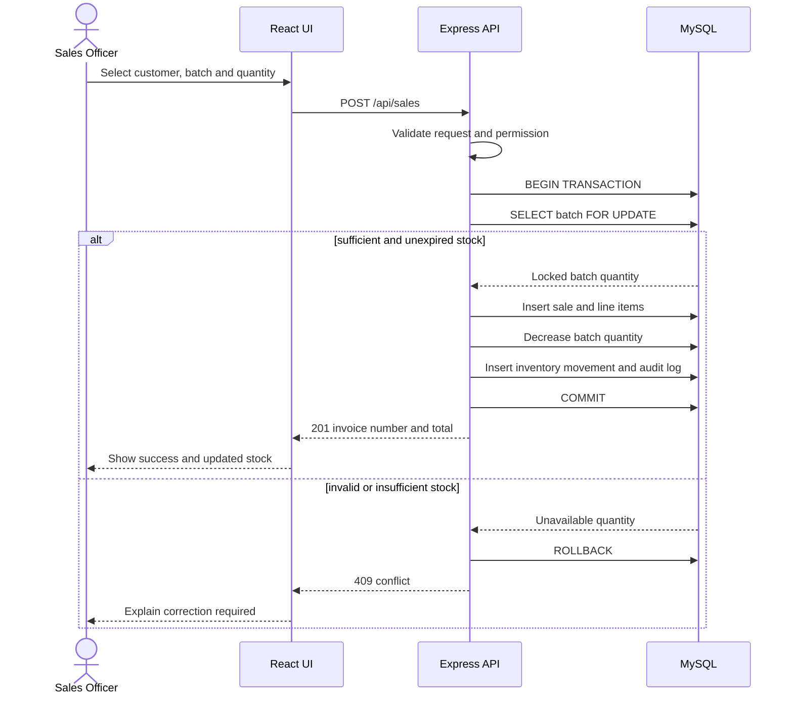

# Sequence Diagram — Post Sale

```mermaid
sequenceDiagram
  actor Clerk as Sales Officer
  participant UI as React UI
  participant API as Express API
  participant DB as MySQL
  Clerk->>UI: Select customer, batch and quantity
  UI->>API: POST /api/sales
  API->>API: Validate request and permission
  API->>DB: BEGIN TRANSACTION
  API->>DB: SELECT batch FOR UPDATE
  alt sufficient and unexpired stock
    DB-->>API: Locked batch quantity
    API->>DB: Insert sale and line items
    API->>DB: Decrease batch quantity
    API->>DB: Insert inventory movement and audit log
    API->>DB: COMMIT
    API-->>UI: 201 invoice number and total
    UI-->>Clerk: Show success and updated stock
  else invalid or insufficient stock
    DB-->>API: Unavailable quantity
    API->>DB: ROLLBACK
    API-->>UI: 409 conflict
    UI-->>Clerk: Explain correction required
  end
```
