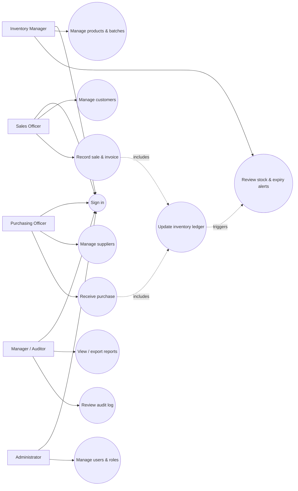

# Use Case Diagram

```mermaid
flowchart LR
  Sales[Sales Officer]
  Inventory[Inventory Manager]
  Purchasing[Purchasing Officer]
  Manager[Manager / Auditor]
  Admin[Administrator]
  Login((Sign in))
  Product((Manage products & batches))
  Supplier((Manage suppliers))
  Purchase((Receive purchase))
  Customer((Manage customers))
  Sale((Record sale & invoice))
  Stock((Update inventory ledger))
  Alerts((Review stock & expiry alerts))
  Reports((View / export reports))
  Audit((Review audit log))
  UsersUC((Manage users & roles))
  Sales --> Login
  Sales --> Customer
  Sales --> Sale
  Inventory --> Login
  Inventory --> Product
  Inventory --> Alerts
  Purchasing --> Login
  Purchasing --> Supplier
  Purchasing --> Purchase
  Manager --> Login
  Manager --> Reports
  Manager --> Audit
  Admin --> Login
  Admin --> UsersUC
  Sale -. includes .-> Stock
  Purchase -. includes .-> Stock
  Stock -. triggers .-> Alerts
```
