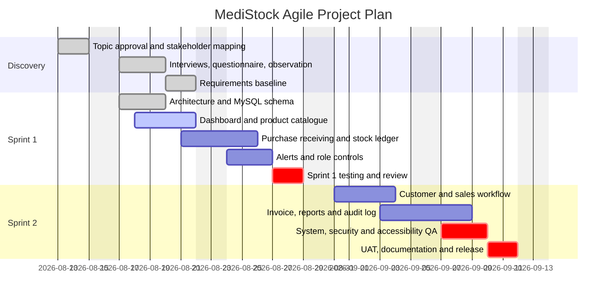

# Project Gantt Chart

The Mermaid source can be rendered in GitHub or exported as an image/PDF from Mermaid Live Editor.

```mermaid
gantt
    title MediStock Agile Project Plan
    dateFormat  YYYY-MM-DD
    excludes    weekends
    section Discovery
    Topic approval and stakeholder mapping :done, d1, 2026-08-13, 2d
    Interviews, questionnaire, observation :done, d2, after d1, 3d
    Requirements baseline                 :done, d3, after d2, 2d
    section Sprint 1
    Architecture and MySQL schema          :done, s1, 2026-08-17, 3d
    Dashboard and product catalogue        :active, s2, 2026-08-18, 4d
    Purchase receiving and stock ledger    :s3, 2026-08-21, 3d
    Alerts and role controls               :s4, 2026-08-24, 3d
    Sprint 1 testing and review             :crit, s5, 2026-08-27, 2d
    section Sprint 2
    Customer and sales workflow            :s6, 2026-08-31, 4d
    Invoice, reports and audit log          :s7, 2026-09-03, 4d
    System, security and accessibility QA   :crit, s8, 2026-09-07, 3d
    UAT, documentation and release          :crit, s9, 2026-09-10, 2d
```
